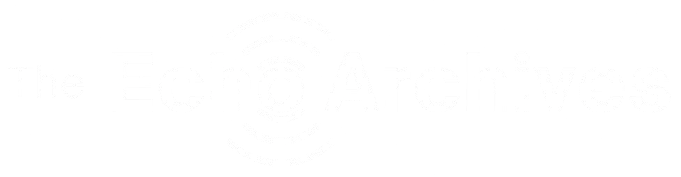

<p align="center">
  
</p>

**A growing ecosystem of web projects, tools, platforms, and experiments.**

Continental brings together digital projects focused on clean design, practical utility, and polished user experiences.

---

## Featured project

<a href="https://echo.continental-hub.com">
  
</a>

### The Echo Archives

**An ad-free archive and review platform for fiction audio dramas.**

The Echo Archives helps listeners discover serialized audio fiction through curated show pages, reviews, tags, ratings, and creator-focused discovery tools.

Built for people who care about immersive storytelling, cinematic sound, strong characters, and shows worth getting properly lost in.

[Visit The Echo Archives](https://echo.continental-hub.com)

---

## Focus areas

- Web platforms
- Backend systems
- Discord bots
- UI/UX polish
- Self-hosted infrastructure
- Experimental tools

## Status

Continental is actively being built, refined, and expanded.

## Links

- Hub: [continental-hub.com](https://continental-hub.com)
- Echo Archives: [echo.continental-hub.com](https://echo.continental-hub.com)
- Contact: [contact.continental-hub.com](https://contact.continental-hub.com)
```
